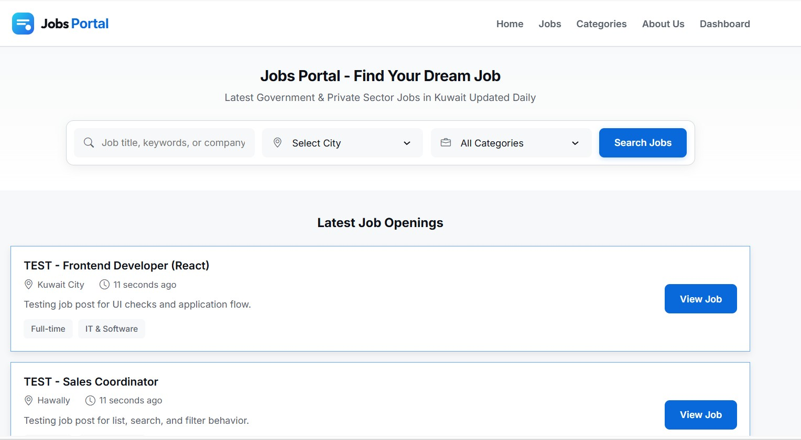
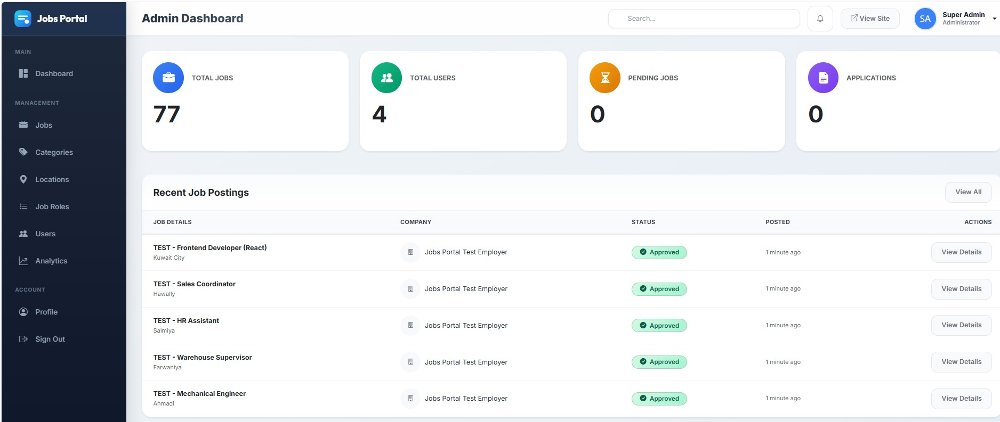
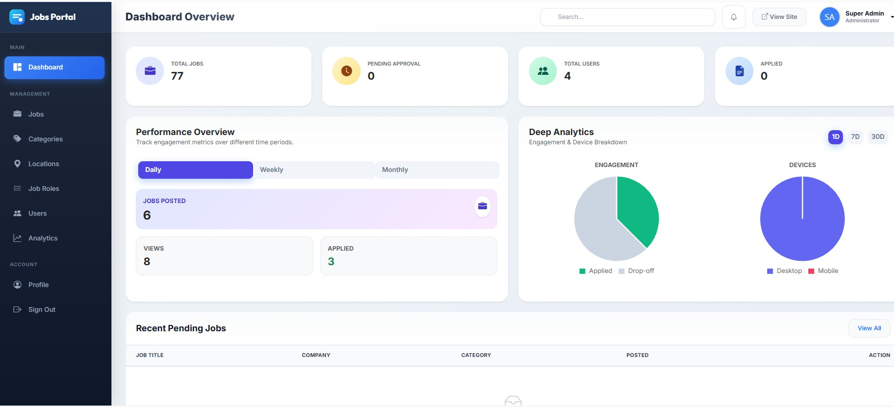
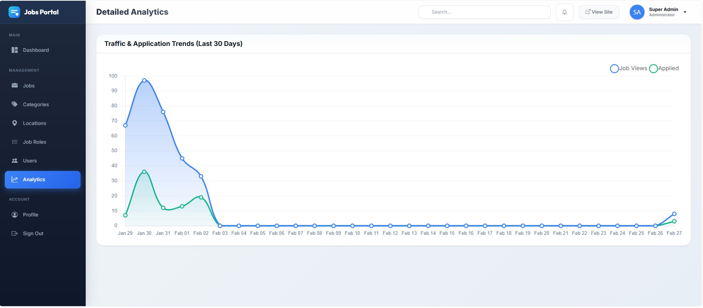
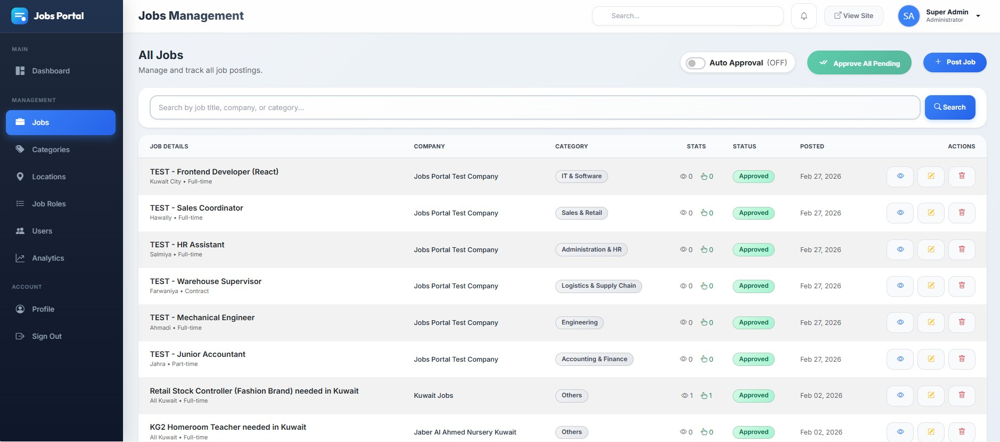
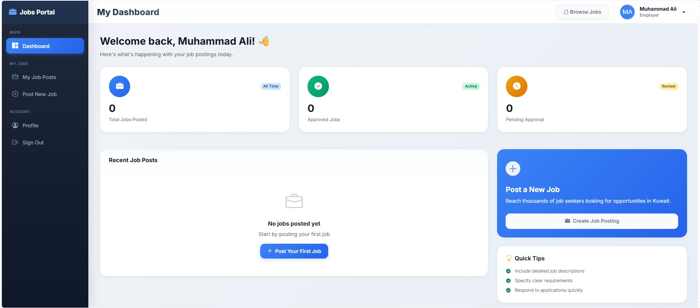
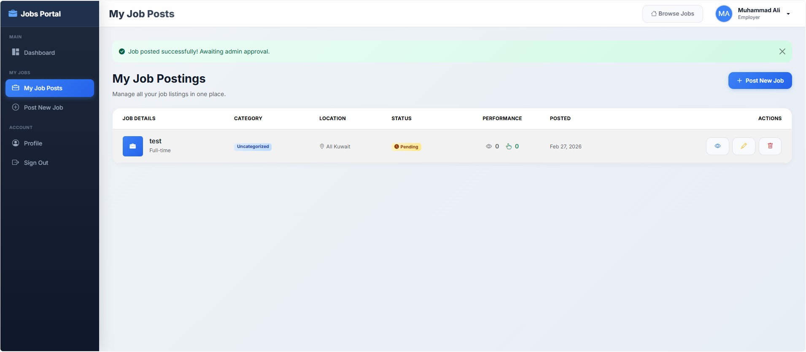

# Jobs Portal

A Laravel 12 job portal web application where employers can post jobs, users can browse and apply, and admins can manage jobs, categories, locations, users, and site settings.

## Features

- Public jobs listing with search and filters
- Job detail page with apply methods:
  - WhatsApp
  - Email
  - External website URL
- Employer/User dashboard:
  - Create, edit, delete job posts
- Admin panel:
  - Manage jobs (approve/reject/edit/delete)
  - Manage categories
  - Manage locations (country + location name)
  - Manage users
  - Manage job roles
  - Analytics dashboard
- SEO/meta pages:
  - About, FAQ, Privacy, Terms
- Responsive UI for desktop and mobile

## Screenshots

### Home / Landing


### Job Listings


### Job Details


### Admin Dashboard


### Manage Jobs


### Manage Locations


### Mobile View


## Tech Stack

- PHP 8.2+
- Laravel 12
- MySQL (recommended) or SQLite
- Blade templates + Bootstrap

## Admin Login

- Email: `admin@jobportal.com`
- Password: `11223344`

## Installation

1. Clone repository

```bash
git clone <your-repo-url>
cd Kuwait\ Jobs
```

2. Install PHP dependencies

```bash
composer install
```

3. Create environment file

```bash
cp .env.example .env
```

4. Update `.env` values (important)

- `APP_NAME="Jobs Portal"`
- Database settings:
  - `DB_CONNECTION=mysql`
  - `DB_HOST=127.0.0.1`
  - `DB_PORT=3306`
  - `DB_DATABASE=your_database_name`
  - `DB_USERNAME=your_db_user`
  - `DB_PASSWORD=your_db_password`

5. Generate app key

```bash
php artisan key:generate
```

6. Run migrations

```bash
php artisan migrate
```

7. Seed data (optional/demo)

```bash
php artisan db:seed
```

For Pakistan demo data:

```bash
php artisan db:seed --class="Database\\Seeders\\PakistanDemoSeeder"
```

## Run Locally

```bash
php artisan serve
```

Open:

- `http://127.0.0.1:8000`

## Useful Commands

Clear caches:

```bash
php artisan optimize:clear
php artisan view:clear
php artisan config:clear
```

Run tests:

```bash
php artisan test
```

## Notes

- If you change `.env`, run `php artisan config:clear`.
- If updated Blade content does not appear, run `php artisan view:clear`.
- Ensure `storage` and `bootstrap/cache` are writable in production.

## License

This project is licensed under the [MIT License](./LICENSE).
